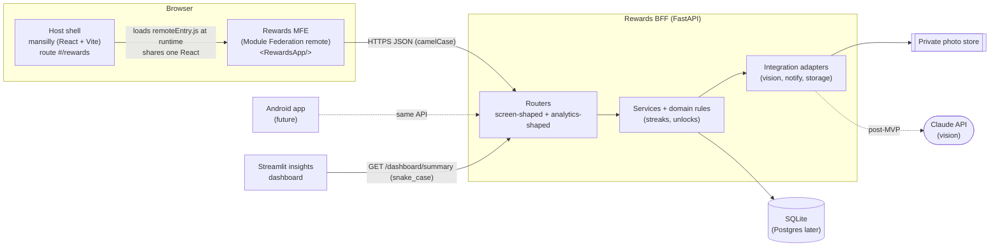
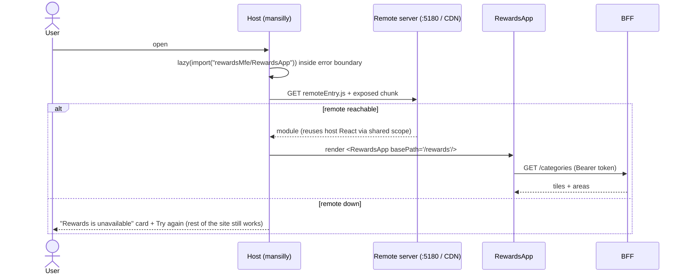
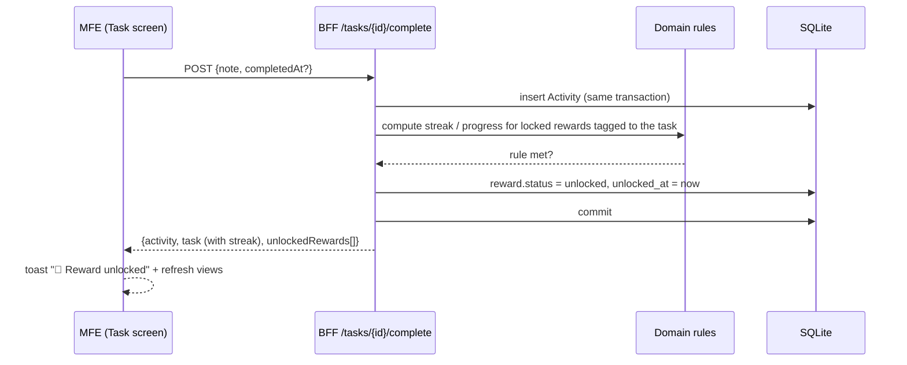
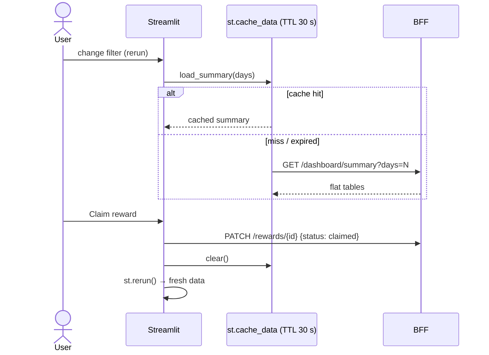
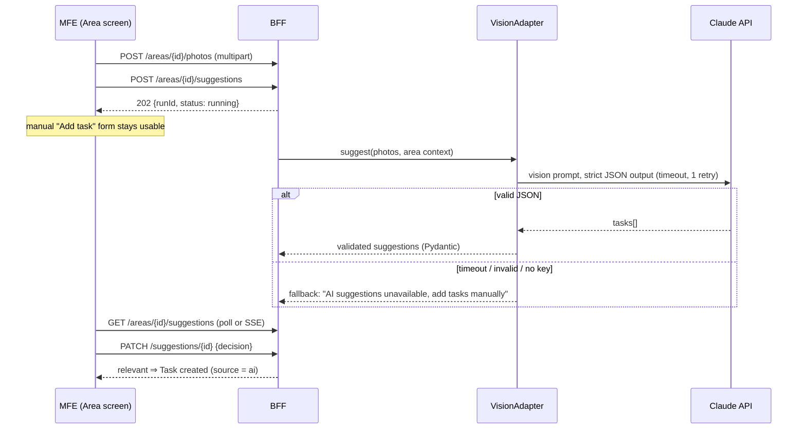

# Rewards Microfrontend: High-Level Design (HLD)

| | |
|---|---|
| **Project** | Capstone: Rewards microfrontend platform for mansilly.vercel.app |
| **Author** | Mansi Gupta |
| **Status** | MVP built (React MFE, FastAPI BFF, Streamlit dashboard). AI photo suggestions are designed but post-MVP |
| **Companion** | [LLD.md](LLD.md): module-level design, API contracts, data model, algorithms |

---

## 1. Purpose and scope

Rewards is a self-motivation module: life is organised into **tiles** (Career, Household, Fun) and **areas** (Kitchen, Learning…). Each area has **tasks** with a frequency. Completing tasks builds **streaks**, and streaks and completions unlock **rewards** you set yourself.

The capstone shows four architecture principles working together in one module:

| Principle | How Rewards demonstrates it |
|---|---|
| **Microfrontend** | `<RewardsApp/>` is built and served on its own and composed into the existing site at runtime via Module Federation |
| **Backend-for-Frontend** | One FastAPI service gives each client the shape it needs: screen-shaped JSON for React/Android, flat tables for Streamlit |
| **Integration services** | External capabilities (AI vision, notifications, storage) sit behind adapters with timeouts, retries and fallbacks |
| **Data app** | A Streamlit insights dashboard that consumes the BFF and never reads the database directly |

**In scope:** the Rewards module end to end, meaning the MFE, BFF, dashboard, and integration design.
**Out of scope (MVP):** real authentication, multiple users, the Android app, other microfrontends, production hardening.

## 2. Goals and non-goals

**Goals**
- G1. A demoable, working loop: area → task → completion → streak → reward unlock → claim → insight.
- G2. **API-first**: every capability is a BFF endpoint, so an Android app can reuse it later with no backend rewrite.
- G3. **Mobile-first** UI: touch targets ≥ 44 px, single column, and it works at 375 px wide.
- G4. **Isolation**: the rewards module can fail, deploy or change without breaking the host site.
- G5. **Graceful degradation**: every external dependency has a visible fallback.

**Non-goals**
- Multi-tenant data, social or sharing features, gamification points economies, payments for rewards.

## 3. Requirements

### 3.1 Functional

| ID | Requirement | MVP |
|---|---|---|
| FR-1 | Show tiles (Career/Office/Work, Household, Fun) with their areas; seed 2 + 13 + 2 areas | ✅ |
| FR-2 | Add, rename and delete areas (name unique per tile; delete cascades to tasks and history) | ✅ |
| FR-3 | Create tasks manually: title, notes, priority (High/Med/Low), frequency (daily/weekly/one-off) | ✅ |
| FR-4 | Reprioritise tasks; change frequency, status (active/done/archived) and relevance | ✅ |
| FR-5 | Filter an area's tasks by priority, status and relevance | ✅ |
| FR-6 | Log a completion (optional note, optional backfill to yesterday or the day before); one-off tasks become *done* | ✅ |
| FR-7 | Activity log per task, newest first | ✅ |
| FR-8 | Current and best streak per task, in calendar days or ISO weeks in the user's timezone | ✅ |
| FR-9 | Create rewards (title, description, optional image URL) with one unlock rule: *N completions* or *streak of N* | ✅ |
| FR-10 | Tag rewards to one or more tasks; show progress; auto-unlock when the rule is met; claim once unlocked | ✅ |
| FR-11 | Insights: completions per tile / area / day, active streaks, reward progress, AI acceptance rate | ✅ |
| FR-12 | Attach area photos; AI suggests tasks (title, why, priority, frequency); user marks Relevant / Not relevant / Ignore; relevant ones become tasks | ⏳ post-MVP |
| FR-13 | Manual task entry stays usable while AI suggestions are running (non-blocking) | ⏳ post-MVP |

### 3.2 Non-functional

| ID | Quality | Target |
|---|---|---|
| NFR-1 | Resilience | Host keeps working if the remote is unreachable; the MFE shows an error with retry if the BFF is down; AI failure falls back to manual entry |
| NFR-2 | Performance | Remote chunk ≤ 50 KB gzipped (currently about 11 KB); first BFF data ≤ 1.5 s locally; dashboard BFF calls cached 30 s |
| NFR-3 | Portability | Only standard HTTP/JSON between tiers; OpenAPI published at `/docs` |
| NFR-4 | Accessibility | Semantic landmarks, labelled controls, `aria-live` status and toasts, visible focus, reduced-motion support |
| NFR-5 | Security (demo level) | Bearer demo token; CORS allow-list; secrets only in server env; photos never publicly served |
| NFR-6 | Testability | Pure domain rules unit-tested; API flows tested through dependency overrides (fake clock, temporary database) |
| NFR-7 | Maintainability | Clear layers (router → service → domain), typed contracts (Pydantic), one-way dependencies |

## 4. Architecture overview

**One BFF, several clients.** A single BFF serves client-specific endpoints rather than one BFF per client. With a single developer, a single domain and a single database, separate BFF deployments would duplicate domain logic without buying real isolation. The per-client split lives at the **schema** level: `ApiModel` (camelCase, screen-shaped) versus `FlatModel` (snake_case, tabular). If Android's needs diverge, for example paging, compact payloads or offline sync, a `/m/*` router or a separate mobile BFF can be added without touching the domain layer.

## 5. Component responsibilities

| Component | Owns | Does not |
|---|---|---|
| **Host shell** (`src/`) | Site chrome, top-level hash routing, mounting remotes, the fallback when a remote fails | Know the MFE's internal routes, API or styles |
| **Rewards MFE** (`apps/rewards-mfe`) | All rewards UI, its sub-routes under `#/rewards/*`, its API client and its CSS (scoped under `.rw-app`) | Call anything except the BFF; depend on host internals |
| **BFF** (`services/bff`) | API contracts, validation, domain rules, persistence, integration orchestration | Render UI; leak storage shape to clients |
| **Domain** (`app/domain.py`) | Streak and unlock rules as pure functions | I/O of any kind |
| **Integration adapters** | Talking to external systems behind an interface, with timeout, retry and fallback | Hold business rules |
| **Streamlit dashboard** (`apps/rewards-dashboard`) | Analytics views, filters, caching | Query the database; hold business rules |

## 6. Key flows

### 6.1 Loading the microfrontend

### 6.2 Completing a task and unlocking a reward (core loop)

### 6.3 Dashboard read and write

### 6.4 Photo → AI task suggestions (post-MVP, designed)

## 7. Data overview

Core entities: **Category** (tile) 1‑N **Area** 1‑N **Task** 1‑N **Activity**; **Reward** N‑N **Task** (through `reward_tasks`); **Area** 1‑N **Photo** and 1‑N **Suggestion** (post-MVP). Streaks and progress are **derived** from Activity rows every time, never stored, so backfills and edits can't leave counters stale. Full ERD in [LLD §5](LLD.md#5-data-model).

## 8. Deployment view

| Tier | Local (today) | Target (post-MVP) |
|---|---|---|
| Host shell | `vite` on :5173 | Existing Vercel project; set `VITE_REWARDS_REMOTE_URL` |
| Rewards MFE | `vite build && vite preview` on :5180 | Its own Vercel project (static); CORS on `/assets/*` |
| BFF | `uvicorn` on :8000, SQLite file | Container on Render / Fly.io / Railway; Postgres; secrets in platform env |
| Photo store | `services/bff/data/photos` (private) | Private object storage (S3 / R2) with short-lived signed URLs |
| Dashboard | `streamlit run` on :8501 | Streamlit Community Cloud, or a container next to the BFF |

The host and remote deploy independently. The contract between them is the remote's name, the exposed module (`./RewardsApp`) and its props.

## 9. Technology choices (ADR summary)

| # | Decision | Alternatives | Why |
|---|---|---|---|
| ADR-1 | Vite + `@originjs/vite-plugin-federation` | Webpack MF, `@module-federation/vite`, iframes | Matches the existing Vite site; small config; runtime composition with a shared React |
| ADR-2 | Host keeps hash routing; the MFE owns `#/rewards/*` | Shared router library | No coupling of router versions between host and remote |
| ADR-3 | MFE styles injected as a scoped string (`.rw-app`) | CSS modules, Shadow DOM | Works the same in the host and standalone; no leakage; no build coupling |
| ADR-4 | FastAPI + Pydantic v2 + async SQLAlchemy | Express, Django | Typed contracts, automatic OpenAPI, dependency injection, async I/O ready for AI calls |
| ADR-5 | Separate ORM tables and API schemas | SQLModel (one class for both) | Makes per-client shapes explicit (the BFF principle) |
| ADR-6 | Streaks derived from the activity log | Stored counters | Always correct under backfill and edits; cheap at this scale |
| ADR-7 | SQLite now, Postgres later | Postgres from day one | Zero-ops demo; SQLAlchemy keeps the swap small |
| ADR-8 | Demo bearer token | OAuth / OIDC | Auth is out of scope; token keeps the API shape auth-ready |
| ADR-9 | `uv` for Python tooling | pip + venv, Poetry | One fast tool: lockfile, venv and runner (like npm) |

## 10. Cross-cutting concerns

- **Error handling (layered).** The host error boundary covers the remote failing to load. A screen boundary inside the MFE covers render bugs. Each data call has loading, error and retry states. Each action shows a toast on failure. The BFF returns consistent `{detail}` errors with 401 / 404 / 409 / 422.
- **Security.** Bearer token on every route except `/health`. CORS allow-list comes from env. Photos are stored outside any static root. The Claude key lives only in BFF env. Input limits are enforced by the schemas.
- **Time and timezones.** Timestamps are stored in UTC. Streaks use the user's local calendar (`BFF_TIMEZONE`). Future completions are rejected.
- **Observability (MVP).** FastAPI access logs, host console error on remote failure. Next step: request IDs plus structured JSON logs; adapter latency and fallback counters.
- **Accessibility.** Radio-group chips, labelled inputs, `role="status"` and `role="alert"`, 16 px inputs (no iOS zoom), `prefers-reduced-motion`.

## 11. Capstone roadmap: BFF and integration services for Rewards

All of these extend the **same Rewards module**: new adapters behind the BFF and new client-shaped endpoints. No new microfrontends.

| # | Service | Type | What it adds to Rewards | Principle shown | Effort | Priority |
|---|---|---|---|---|---|---|
| 1 | **Vision suggestion adapter** (Claude) | Integration | Photo of an area → suggested tasks with *why*, priority and frequency; Relevant / Not relevant / Ignore feedback | Adapter interface, strict JSON + Pydantic validation, timeout/retry/fallback, async job | M | **P1** (already designed, §6.4) |
| 2 | **Domain events + outbox** (`TaskCompleted`, `RewardUnlocked`, `StreakAtRisk`) | BFF internals | Decouples side effects (notifications, analytics) from the request path | Event-driven integration, reliable delivery | M | **P1** |
| 3 | **Reminder / notification service** | Integration | "Your Kitchen streak ends tonight" nudges: web push now, FCM for Android later, email fallback | Scheduler + channel adapters, user-level quiet hours | M | **P1** |
| 4 | **Calendar feed (iCal/ICS)** | BFF endpoint | `GET /calendar.ics`: daily/weekly tasks appear in Google or Apple Calendar with no OAuth | Read-only integration by open standard | S | P2 |
| 5 | **Object-storage adapter** for photos | Integration | Swap local disk for S3 / R2 with signed URLs | Ports & adapters; environment-driven wiring | S | P2 |
| 6 | **Weekly AI coach summary** | Integration | A short LLM review built from `/dashboard/summary` ("3 streaks alive, Laundry slipping") | Same adapter pattern, text-only, cached per week | S | P2 |
| 7 | **Reward link enrichment** | Integration | Paste a product or experience URL → title and image via OpenGraph fetch | Outbound HTTP with SSRF-safe allow-listing | S | P3 |
| 8 | **Mobile BFF surface** (`/m/*`) | BFF | Compact payloads, cursor paging, ETags, **idempotency keys** on `/complete` for offline retries | BFF per client class; Android-readiness | M | P2 (before Android) |
| 9 | **Realtime status (SSE)** | BFF | Push AI-suggestion and unlock events instead of polling | Async UX, server push | S | P3 |
| 10 | **Auth (OIDC, e.g. Google sign-in)** | Integration | Replace the demo token; per-user data | Token validation at the BFF edge | M | P3 (after the capstone demo) |
| 11 | **Generated API clients** from OpenAPI | Tooling | Typed TypeScript client for the MFE, Kotlin client for Android | Contract-first development | S | P2 |

**Recommended capstone cut:** 1 + 2 + 3. Vision, events and reminders together show every principle: an external AI dependency with fallbacks, internal decoupling through events, and a second outbound channel that Android will reuse. Items 4 and 11 are quick wins if time allows.

## 12. Risks and mitigations

| Risk | Impact | Mitigation |
|---|---|---|
| Remote unreachable in production (not deployed, wrong URL) | `#/rewards` unavailable | Host fallback card; env-driven URL; deploy the MFE before merging to `main` |
| Shared React version drift between host and remote | Hook errors at runtime | Both pinned to React 19; `shared: ["react","react-dom"]`; check in CI later |
| `@originjs` plugin requires a built remote (no remote dev mode) | Slower remote iteration | Standalone `npm run dev` for UI work; `serve:remote` for the federated check |
| AI returns malformed or unsafe output | Broken UI / bad tasks | Strict JSON schema + Pydantic; user must approve each suggestion; fallback message |
| SQLite on an ephemeral host | Data loss | Postgres (or a mounted volume) before any hosted demo |
| Demo token exposed in the bundle | Anyone can call the API | Acceptable for the demo; OIDC in roadmap #10 |

## 13. Status

| Phase | Scope | State |
|---|---|---|
| 1 | Repo audit, structure, federation plan | ✅ |
| 2 | BFF data model, seed, task/reward endpoints, tests | ✅ (26 tests) |
| 3 | Rewards MFE screens + host integration; old in-site rewards removed | ✅ |
| 5 | Streamlit insights dashboard | ✅ |
| 4 | Photo upload + vision adapter | ⏳ post-MVP (designed) |
| 6 | One-command run, README, demo script | ⏳ next |
