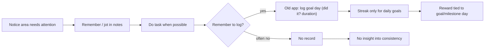
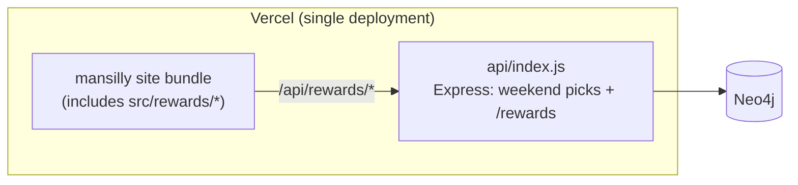
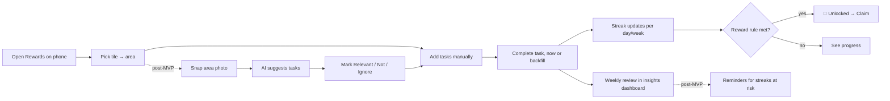
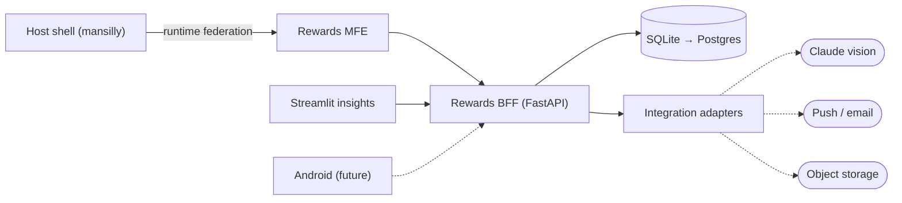

# Rewards Microfrontend: High-Level Requirements Document (HLRD)

| | |
|---|---|
| **Project** | Capstone: Rewards microfrontend platform (React MFE + FastAPI BFF + integration services + Streamlit insights) |
| **Product owner / author** | Mansi Gupta |
| **Version** | 1.0 (MVP baseline) · 2026-09-28 |
| **Related** | [LLRD.md](LLRD.md) (detailed requirements) · [HLD.md](HLD.md) / [LLD.md](LLD.md) (design) |

---

## 1. Executive summary

Home, career and fun tasks are tracked informally today. Rewards for keeping up are ad hoc, and there's no visibility of consistency. An earlier in-site "Reward Goals" feature existed, but it was goal-centric, tightly coupled to the main site and its Neo4j backend, and not reusable by other clients.

This capstone replaces it with a **Rewards microfrontend**:
- a React module loaded into the site at runtime;
- a **Backend-for-Frontend** that serves the web UI, an analytics dashboard and a future Android app;
- **integration services** (AI photo → task suggestions, reminders) behind resilient adapters.

---

## 2. Discovery

### 2.1 Problem statement

> *As a busy working parent, I want to turn the upkeep of each part of my home, career and leisure into small recurring tasks, see my consistency, and reward myself when I keep it up, without the tool becoming another chore.*

### 2.2 Personas

| Persona | Context | Needs | Frustrations |
|---|---|---|---|
| **Mansi, primary user** | Working parent; manages household areas (kitchen, laundry, kids' toys), career learning, hobbies | Quick capture on a phone, see what's due, feel progress, self-set treats | Lists get stale; no sense of streaks; motivation fades mid-week |
| **Mansi, reviewer** (weekly) | Sunday reflection | Where did effort go? Which streaks are alive? Which rewards are close? | No aggregate view; can't see neglected areas |
| **Capstone evaluator** | Assesses architecture | Clear demonstration of MFE, BFF, integration and data-app principles | Monoliths that "claim" microfrontends |
| **Future: family member** (out of scope) | Shares household areas | Assigned tasks, own rewards | — |

### 2.3 Discovery findings

| # | Source | Finding | Implication |
|---|---|---|---|
| D1 | Codebase audit (`main`) | An existing in-site Rewards feature: goals with target days, daily logs, milestones, ₹-valued rewards, 6 fixed categories | Validates the need; its **goal** model doesn't fit recurring upkeep of physical areas |
| D2 | Codebase audit | Old feature bundled in the host, dark inline styles, Express + **Neo4j** API shared with the Weekend Picks backend | Can't deploy, scale or fail independently; heavy infrastructure for simple relational data |
| D3 | Codebase audit | Passcode gate built but disabled; no auth in practice | Demo-level token is acceptable for MVP; real auth later |
| D4 | Branch audit | An abandoned Next.js "reward-system" scaffold (React 18) that couldn't be federated into the Vite/React 19 host | Choose Vite-native federation; keep React versions aligned |
| D5 | User interview (self) | Upkeep is **area-based** (Kitchen, Wardrobe, Shiragi Toys) not goal-based; frequencies differ (daily vs weekly vs one-off) | Tiles → areas → tasks model with per-task frequency |
| D6 | User interview | Deciding *what* to do in an area is the hard part | Photo of the area → AI suggests tasks (post-MVP) |
| D7 | User interview | Tasks are often done and logged later | Backfill completions ("yesterday") |
| D8 | User interview | Wants weekly insight, not just a to-do list | Separate analytics client (Streamlit) |
| D9 | Roadmap | An Android app is planned | API-first BFF; mobile-first UI |

### 2.4 Assumptions

- A1. Single user for the MVP; data is personal and low volume (< 1k tasks, < 50k completions).
- A2. The user's calendar is one timezone (Asia/Kolkata by default).
- A3. Rewards are self-fulfilled. There's no purchasing or payment integration.
- A4. The host site remains Vite + React 19 with hash routing.

### 2.5 Constraints

- C1. Existing Vercel deployment of the host must keep building (`npm run build → dist`).
- C2. Solo developer, capstone timeline; prefer managed or zero-ops components.
- C3. AI API keys must never reach the browser.
- C4. Out of scope: Android build, real auth, multi-user, other microfrontends, WhatsApp/Apify/Snowflake integrations.

---

## 3. As-Is

### 3.1 As-Is process

### 3.2 As-Is system

### 3.3 As-Is capabilities and pain points

| Area | As-Is | Pain point |
|---|---|---|
| Structure | Goals in 6 fixed categories (Food & Kitchen, Health, House, Learning, Creative, Finance) | No notion of physical areas; can't reflect "Kitchen Utility Area" vs "Kitchen" |
| Frequency | Daily log per goal; target days | Weekly and one-off upkeep doesn't fit |
| Logging | "Did it today" + duration + note | No backfill; missed logs break streaks unfairly |
| Rewards | Linked to a goal or milestone day; ₹ value | Can't share one reward across several tasks; no completion-count rule |
| Insight | Summary cards (active goals, to log today, earned) | No per-area or time-series view |
| Architecture | Bundled into the host; Neo4j via shared Express API | No independent deploy/failure; not reusable by Android; heavy DB for simple data |
| Resilience | Single request path; errors surface raw | Rewards failure affects the page |
| AI | None | Deciding what to do is manual |

---

## 4. To-Be

### 4.1 To-Be process

### 4.2 To-Be system

### 4.3 Gap analysis (As-Is → To-Be)

| # | Capability | As-Is | To-Be | Change type |
|---|---|---|---|---|
| G1 | Organising model | Goals × 6 categories | 3 tiles × editable areas × tasks | Replace |
| G2 | Frequency | Daily only | Daily, weekly, one-off | Extend |
| G3 | Streaks | Daily streak per goal | Per-task streak in days or weeks; current + best; backfill-safe | Replace |
| G4 | Reward rules | Goal/milestone-bound | Tag to many tasks; *N completions* or *streak of N*; auto-unlock; claim | Replace |
| G5 | Prioritisation | None | High/Med/Low; filter by priority, status, relevance | New |
| G6 | AI assistance | None | Photo → suggested tasks with human approval | New (post-MVP) |
| G7 | Insights | 3 summary cards | Dashboard: by tile/area/day, streaks, reward progress, AI acceptance | New |
| G8 | Delivery | Bundled into host | Independently built and deployed MFE; host fallback | Re-architect |
| G9 | Backend | Express + Neo4j shared with other features | Dedicated BFF, typed contracts, OpenAPI, relational store | Re-architect |
| G10 | Clients | Web only | Web, analytics, Android-ready API | New |

### 4.4 Transition plan

| Step | Description | Status |
|---|---|---|
| T1 | Build the BFF and seed tiles/areas | ✅ |
| T2 | Build the MFE; mount it on `#/rewards`; remove the old in-site rewards + `/rewards` Express routes | ✅ (branch) |
| T3 | Build the Streamlit insights client | ✅ |
| T4 | Deploy the MFE + BFF; set the host's remote URL; merge to `main` | ⏳ |
| T5 | Integration services: vision → events/outbox → reminders | ⏳ |
| T6 | Mobile BFF surface; Android client | ⏳ future |

No data migration from Neo4j is planned. The old feature held no production data worth carrying over (its auth gate was disabled and the new model differs). Confirm before T4.

---

## 5. Scope

| In scope (MVP) | Post-MVP (capstone extensions) | Out of scope |
|---|---|---|
| Tiles/areas CRUD, tasks, completions, streaks, rewards, claim | Photo → AI suggestions (vision adapter) | Android app build |
| React MFE + host integration | Domain events + outbox; reminders (push/email) | Real auth / multi-user |
| FastAPI BFF with per-client shapes | Calendar ICS feed; object storage; AI weekly coach | Other microfrontends |
| Streamlit insights | Mobile BFF surface; OIDC | WhatsApp, Apify, Snowflake |

---

## 6. High-level requirements

### 6.1 Business requirements

| ID | Requirement | Success measure |
|---|---|---|
| BR-1 | Make recurring upkeep visible and motivating | ≥ 3 active streaks maintained for 2 weeks in personal use |
| BR-2 | Reduce effort to decide what to do in an area | Post-MVP: ≥ 50 % of AI suggestions marked Relevant |
| BR-3 | Provide weekly insight into effort distribution | Weekly review done from the dashboard in < 2 min |
| BR-4 | Demonstrate MFE, BFF, integration and data-app principles (capstone) | 3-minute demo script runs end to end |
| BR-5 | Be ready for an Android client without backend rewrite | All user actions available via documented API (OpenAPI) |

### 6.2 High-level functional requirements (epics)

| ID | Epic | Summary | Traces to (LLRD) | MVP |
|---|---|---|---|---|
| HLR-1 | Tiles & areas | Browse 3 tiles; seeded, editable areas | LLR-1.x | ✅ |
| HLR-2 | Task management | Create, prioritise, filter, change status/frequency/relevance | LLR-2.x | ✅ |
| HLR-3 | Completion & streaks | Log completions with note/backfill; activity log; current/best streak | LLR-3.x | ✅ |
| HLR-4 | Rewards | Create, tag, progress, auto-unlock, claim | LLR-4.x | ✅ |
| HLR-5 | Insights dashboard | Aggregates, filters, cached reads, claim from dashboard | LLR-5.x | ✅ |
| HLR-6 | AI task suggestions | Photos → suggestions → decisions → tasks; non-blocking | LLR-6.x | ⏳ |
| HLR-7 | Module composition | Independently delivered MFE with host fallback | LLR-7.x | ✅ |
| HLR-8 | API (BFF) | Versionable, documented, client-shaped API with demo auth | LLR-8.x | ✅ |

### 6.3 High-level non-functional requirements

| ID | Category | Requirement |
|---|---|---|
| HNFR-1 | Usability | Mobile-first; every primary action reachable in ≤ 3 taps from the area screen |
| HNFR-2 | Resilience | No single dependency failure (remote, BFF, AI) blanks the host page |
| HNFR-3 | Performance | Rewards screen interactive ≤ 2 s on local/broadband; dashboard cached reads |
| HNFR-4 | Security | Secrets server-side only; CORS allow-list; private photo storage |
| HNFR-5 | Accessibility | WCAG 2.2 AA intent: labels, focus, live regions, contrast, reduced motion |
| HNFR-6 | Maintainability | Typed contracts; pure, unit-tested business rules; ≥ 1 test per business rule |
| HNFR-7 | Portability | HTTP/JSON only between tiers; storage swappable (SQLite → Postgres) |

---

## 7. Stakeholders and RACI

| Activity | Mansi (PO/dev) | Capstone evaluator | Future Android dev |
|---|---|---|---|
| Requirements & priorities | A/R | C | I |
| Architecture & build | A/R | C | C (API) |
| Demo & evaluation | R | A | — |

## 8. Dependencies

Vercel (host + MFE hosting); a Python host for the BFF (post-MVP deploy); the Anthropic API (post-MVP vision); `@originjs/vite-plugin-federation`; Streamlit.

## 9. Risks

| Risk | Likelihood | Impact | Mitigation |
|---|---|---|---|
| Remote not deployed when merged → `#/rewards` shows fallback | M | M | Deploy the MFE + BFF before merging to `main` (T4) |
| AI suggestions low quality | M | L | Human approval per suggestion; acceptance-rate metric in the dashboard |
| Scope creep into other modules | M | M | Capstone limited to Rewards; roadmap items gated by priority |
| React version drift host ↔ remote | L | H | Shared singleton; pinned versions; smoke check |

## 10. Acceptance (MVP)

The MVP is accepted when the demo runs without manual workarounds:
1. Open `#/rewards` → Household → Kitchen.
2. Add a task.
3. Complete it (yesterday + today) → streak 2.
4. Tag a *3 completions* reward → complete again → unlock toast → claim.
5. The Streamlit dashboard reflects completions, streaks and the claim.
6. With the remote or BFF stopped, the site shows the documented fallbacks.
