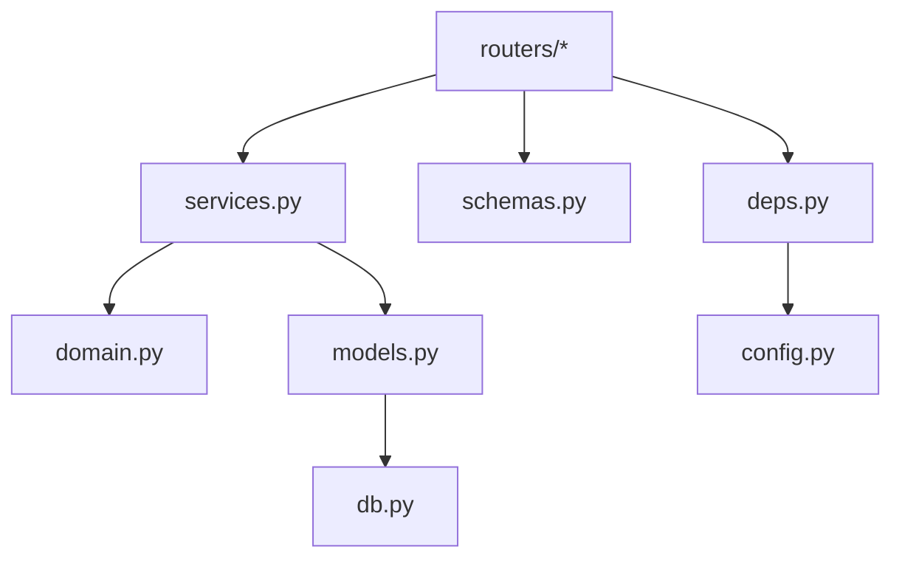
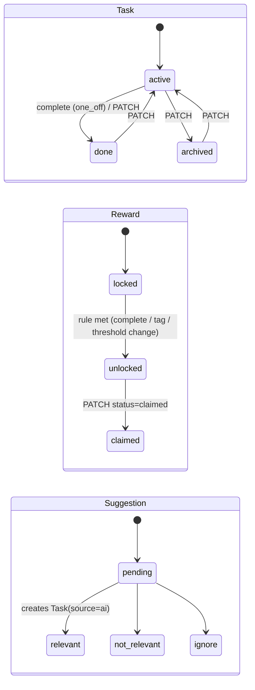
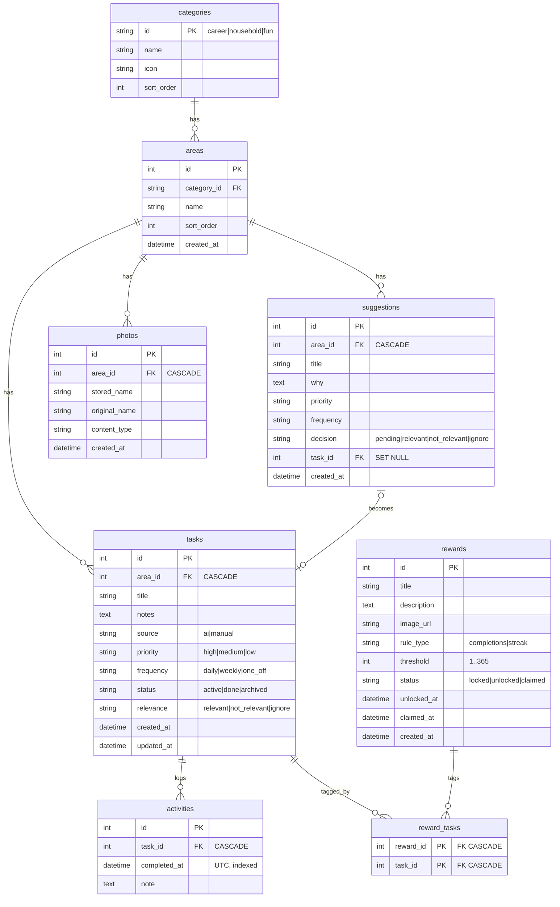

# Rewards Microfrontend: Low-Level Design (LLD)

Companion to [HLD.md](HLD.md). This document describes the code as built on `feature/rewards-mfe-bff`, plus the designed-but-not-built post-MVP parts (marked ⏳).

---

## 1. Repository layout

```
/                               host shell (existing site, Vite + React 19)
├─ src/App.jsx                  hash routing; /rewards and /rewards/* → <RemoteRewards/>
├─ src/components/RemoteRewards.jsx   lazy remote import + error boundary + fallback
├─ vite.config.js               federation host; remote URL from VITE_REWARDS_REMOTE_URL
├─ apps/rewards-mfe/            React remote (Vite + @originjs/vite-plugin-federation)
│  └─ src/
│     ├─ RewardsApp.jsx         exposed root: providers, tabs, router switch, toasts
│     ├─ api.js                 BFF client (only way out)
│     ├─ context.js             RewardsContext {api, links, toast, celebrate}
│     ├─ lib/router.js          hash sub-router under basePath
│     ├─ lib/useResource.js     loading/error/data hook with stale-response guard
│     ├─ components/ui.jsx      states, chips, badges, progress, toasts, useAction
│     ├─ screens/*.jsx          Tiles, Category, Area, Task, Rewards
│     └─ rewards.css            scoped under .rw-app, injected at mount
├─ services/bff/                FastAPI BFF (uv project)
│  ├─ app/main.py               app factory, lifespan, CORS, router wiring
│  ├─ app/config.py             Settings (BFF_* env)
│  ├─ app/db.py                 engine, sessionmaker, UTCDateTime
│  ├─ app/models.py             SQLAlchemy tables (storage shape)
│  ├─ app/schemas.py            Pydantic API shapes (ApiModel camelCase, FlatModel snake_case)
│  ├─ app/domain.py             pure rules: streaks, reward progress
│  ├─ app/services.py           DB-backed helpers: stats, unlock evaluation, response builders
│  ├─ app/deps.py               DI: settings, session, clock, demo token
│  ├─ app/seed.py               first-run tiles + areas
│  ├─ app/routers/              areas, tasks, rewards, dashboard
│  └─ tests/                    test_domain.py, test_api.py (26 tests)
├─ apps/rewards-dashboard/      Streamlit (uv project): app.py, bff_client.py
└─ docs/rewards/                HLD.md, LLD.md
```

## 2. Microfrontend (React remote)

### 2.1 Federation contract

| Item | Value |
|---|---|
| Remote name | `rewardsMfe` |
| Entry | `<remote-origin>/assets/remoteEntry.js` |
| Exposed module | `./RewardsApp` → `src/RewardsApp.jsx` (default export) |
| Shared | `react`, `react-dom` (the host provides them; the remote bundles no React of its own) |
| Props | `apiBaseUrl?: string` (default `VITE_BFF_URL`), `token?: string` (default `VITE_BFF_TOKEN`), `basePath?: string` (default `"/rewards"`) |
| Build | `target: esnext` (top-level await in the federation runtime), `modulePreload: false`, `cssCodeSplit: false` |

The host passes only `basePath`. BFF configuration belongs to the remote, which keeps the host unaware of the backend.

### 2.2 Host integration

```jsx
// src/components/RemoteRewards.jsx (simplified)
const RewardsApp = lazy(() => import("rewardsMfe/RewardsApp"));
<RemoteBoundary>                       // catches load failure → fallback card
  <Suspense fallback="Loading rewards…">
    <RewardsApp basePath="/rewards" />
  </Suspense>
</RemoteBoundary>
```

*Try again* does a full reload, because browsers cache a failed dynamic `import()` for the page's lifetime; re-running `lazy()` can't recover.

### 2.3 Routing (owned by the MFE)

| Hash | Route name | Screen | Data calls |
|---|---|---|---|
| `#/rewards` | `tiles` | TilesScreen | `GET /categories` |
| `#/rewards/c/:categoryId` | `category` | CategoryScreen | `GET /categories`; `POST/PATCH/DELETE /areas` |
| `#/rewards/a/:areaId` | `area` | AreaScreen | `GET /areas/:id`, `GET /areas/:id/tasks?…`; `POST /areas/:id/tasks`, `PATCH /tasks/:id`, `POST /tasks/:id/complete` |
| `#/rewards/t/:taskId` | `task` | TaskScreen | `GET /tasks/:id`, `GET /tasks/:id/activity`, `GET /rewards`; `PATCH /tasks/:id`, `POST …/complete`, `PUT /rewards/:id/tasks` |
| `#/rewards/my-rewards` | `rewards` | RewardsScreen | `GET /rewards?status`, `GET /tasks?status=active`; `POST /rewards`, `PATCH /rewards/:id`, `PUT /rewards/:id/tasks` |

`useHashRoute(basePath)` listens to `hashchange`. Links are real `<a href="#/rewards/…">`, so back/forward, deep links and open-in-new-tab all work. Screens are keyed by route parameter, so navigating between two tasks resets their local state.

### 2.4 Component tree

```
RewardsApp  (RewardsContext.Provider: api, links, toast, celebrate)
├─ nav.rw-tabs            Areas | Rewards
├─ ScreenBoundary         (reset on route change)
│  └─ Screen switch
│     ├─ TilesScreen
│     ├─ CategoryScreen → AreaRow (inline rename / delete)
│     ├─ AreaScreen → AddTaskForm, Filters (Chips), TaskList → TaskRow (priority select, ✓)
│     │   └─ ⏳ PhotoSuggestionsPanel (post-MVP, runs in parallel with AddTaskForm)
│     ├─ TaskScreen → stats, LogCompletion, TaskRewards, Settings (Chips), ActivityLog
│     └─ RewardsScreen → CreateReward (TaskPicker), RewardCard (claim / edit tags)
└─ Toasts (aria-live)
```

### 2.5 State and data fetching

- **Server state**: `useResource(load, deps)` returns `{data, error, loading, reload, refresh}`.
  - A request counter drops out-of-order responses when inputs change mid-flight.
  - `refresh()` re-fetches quietly after a mutation, so the current data stays on screen with no loading flash.
- **UI state**: local `useState` (forms, filters, edit toggles).
- **Mutations**: `useAction(toast)` returns `[pending, run]`. It blocks double submits, shows a toast on error and an optional success toast.
- **Cross-screen events**: `celebrate(unlockedRewards)` shows the unlock toast. Completing a task returns `unlockedRewards`, so no extra request is needed.
- No global store. Each screen fetches its own shape, which is what the BFF provides.

### 2.6 Error-handling layers

| Layer | Catches | UX |
|---|---|---|
| Host `RemoteBoundary` | remote chunk can't load | "Rewards is unavailable right now" + reload |
| MFE `ScreenBoundary` | render exceptions | "This screen hit an unexpected error" + retry |
| `<Resource>` / list components | failed GET | inline error + *Try again* |
| `useAction` | failed mutation | error toast; form keeps its input |
| `api.js` | network failure → `ApiError(status 0)`; HTTP error → FastAPI `detail` message | human-readable message |

### 2.7 Styling

`rewards.css` is imported as a string (`?inline`) and injected once with `useInsertionEffect` as `<style id="rewards-mfe-styles">`. Every selector is prefixed `.rw-app`. Colour tokens fall back to the host's CSS variables (`var(--leaf, #2f6f58)`), so the remote matches the host but also renders standalone. Mobile-first: one column, 44 px tap targets, 16 px inputs; tiles switch to a 3-column grid at ≥ 640 px.

## 3. BFF (FastAPI)

### 3.1 Layers and dependency direction



The domain layer imports nothing from the web or database layers. Routers never build SQL for another router's resources.

### 3.2 Dependency injection

| Dependency | Provides | Overridden in tests |
|---|---|---|
| `get_settings` | `Settings` from `app.state` | temp database path, token, timezone |
| `get_session` | `AsyncSession` per request (closed after the response) | (uses the test database) |
| `get_now` | current UTC `datetime` | `Clock` fixture (frozen, movable) |
| `require_demo_token` | router-level guard | the test client sends a matching header |

### 3.3 Endpoint catalogue

All routes except `/health` need `Authorization: Bearer <BFF_DEMO_TOKEN>`. Request bodies accept camelCase or snake_case. Responses are camelCase, except `/dashboard/*`, which returns snake_case.

| Method | Path | Body / query | Response | Errors |
|---|---|---|---|---|
| GET | `/health` | — | `{status}` | — |
| GET | `/categories` | — | `CategoryOut[]` (with `areas[]`, `activeTaskCount`) | 401 |
| GET | `/areas/{id}` | — | `AreaDetail` | 404 |
| POST | `/areas` | `{categoryId, name}` | `AreaOut` 201 | 404 category, 409 duplicate, 422 |
| PATCH | `/areas/{id}` | `{name}` | `AreaOut` | 404, 409, 422 |
| DELETE | `/areas/{id}` | — | 204 (cascades) | 404 |
| GET | `/areas/{id}/tasks` | `?priority&status&relevance` | `TaskOut[]` sorted high→low, then oldest | 404, 422 |
| POST | `/areas/{id}/tasks` | `TaskCreate` | `TaskOut` 201 (`source=manual`) | 404, 422 |
| GET | `/tasks` | `?status` | `TaskWithArea[]` (picker) | 422 |
| GET | `/tasks/{id}` | — | `TaskDetail` (+ `area`, `rewards[]` with `progressPercent`) | 404 |
| PATCH | `/tasks/{id}` | `TaskUpdate` (partial; null rejected) | `TaskOut` | 404, 422 |
| POST | `/tasks/{id}/complete` | `{note?, completedAt?}` | `CompleteResponse` 201 | 404, 409 not active, 422 future |
| GET | `/tasks/{id}/activity` | — | `ActivityOut[]` newest first | 404 |
| GET | `/rewards` | `?status` | `RewardOut[]` newest first | 422 |
| POST | `/rewards` | `RewardCreate` (`taskIds[]` optional) | `RewardOut` 201 (may already be `unlocked`) | 422 unknown task / rule |
| PATCH | `/rewards/{id}` | `RewardUpdate` (`status` only `"claimed"`) | `RewardOut` | 404, 409 still locked, 422 |
| PUT | `/rewards/{id}/tasks` | `{taskIds[]}` (full replace) | `RewardOut` | 404, 422 |
| GET | `/dashboard/summary` | `?days=1..365` | `DashboardSummary` (snake_case) | 422 |
| ⏳ POST | `/areas/{id}/photos` | multipart `files[]` (jpeg/png/webp, ≤ 5 MB each) | `PhotoOut[]` 201 | 413, 415 |
| ⏳ POST | `/areas/{id}/suggestions` | `{photoIds[]}` | 202 `{runId, status}` | 404 |
| ⏳ GET | `/areas/{id}/suggestions` | `?runId` | `{status, message?, suggestions[]}` | 404 |
| ⏳ PATCH | `/suggestions/{id}` | `{decision}` | `SuggestionOut` (+ `taskId` if relevant) | 404, 409 decided |

Example: `POST /tasks/7/complete`

```json
// request
{ "note": "After dinner", "completedAt": "2026-09-27T14:12:00Z" }
// 201 response
{
  "activity": { "id": 31, "taskId": 7, "completedAt": "2026-09-27T14:12:00Z", "note": "After dinner" },
  "task": { "id": 7, "title": "Wipe counters", "frequency": "daily", "status": "active",
            "completionCount": 3, "currentStreak": 2, "bestStreak": 2, "...": "..." },
  "unlockedRewards": [ { "id": 2, "title": "Coffee out", "status": "unlocked",
                         "progress": { "current": 3, "target": 3, "percent": 100 }, "...": "..." } ]
}
```

Error format (FastAPI default): `{"detail": "Only active tasks can be completed (this one is done)"}`. Validation errors: `{"detail": [{"loc": [...], "msg": "..."}]}`.

### 3.4 Transaction boundaries

Every mutating handler is one `AsyncSession` transaction. `complete_task` works like this:
1. insert the Activity and `flush()` it, so it's visible inside this transaction;
2. evaluate the locked rewards tagged to the task;
3. flip the rewards whose rule is met;
4. `commit()`.

Unlock evaluation also runs on `POST /rewards`, `PATCH /rewards/{id}` and `PUT /rewards/{id}/tasks`, because tagging tasks or lowering a threshold can satisfy the rule.

## 4. Domain rules (`app/domain.py`)

### 4.1 Streaks

```
period_index(day, daily)  = day.toordinal()
period_index(day, weekly) = (day.toordinal() - 1) // 7      # Monday-based weeks (date(1,1,1) is a Monday)

compute_streak(days, frequency, today):
  one_off → current = best = 1 if any completion else 0
  periods = sorted(unique(period_index(d)))                    # repeats in one period count once
  best    = longest run of consecutive integers in periods
  current = length of the run ending at periods[-1]
            if periods[-1] ≥ period_index(today) - 1 else 0     # alive until a whole period is missed
```

Completion times are stored in UTC and converted to `BFF_TIMEZONE` (default Asia/Kolkata) before taking the date. Stats for many tasks are computed with **one** activity query (`services.task_stats`).

### 4.2 Reward progress and unlock

```
value = Σ completionCount(tagged tasks)        if rule = completions
      = max currentStreak(tagged tasks)        if rule = streak
if status ≠ locked: value = max(value, threshold)     # stays complete after a streak breaks
progress = min(value, threshold) / threshold
unlock when status = locked and progress.met → status = unlocked, unlocked_at = now
```

### 4.3 State machines



## 5. Data model



Notes:
- Enumerations are `String` columns validated by Pydantic `Literal` types (portable to Postgres; no native enum migrations).
- `UTCDateTime` stores naive UTC in SQLite and always returns timezone-aware UTC; naive input is rejected.
- SQLite foreign keys are switched on per connection (`PRAGMA foreign_keys=ON`) so `ON DELETE CASCADE` works.
- Schema is created with `create_all` at startup (no migrations in the MVP). Alembic comes with the Postgres move.

## 6. Dashboard (`/dashboard/summary` and Streamlit)

### 6.1 Summary composition (BFF)

| Field | Built from | Window-filtered by `days` |
|---|---|---|
| `totals` | counts over tasks, activities, rewards | completions only |
| `completions_by_category` / `_by_area` | activities → task → area → category | ✅ |
| `completions_by_day` | activities grouped by local date | ✅ |
| `streaks` | `task_stats` over **full** history, current > 0, non-one-off | ❌ (streaks need history) |
| `rewards` | `reward_progress_map` | ❌ |
| `suggestions` | `GROUP BY decision`; `acceptance_rate = relevant / decided` (null if none decided) | ❌ |

### 6.2 Streamlit app

| Concern | Implementation |
|---|---|
| I/O | `BffClient` (httpx, 5 s timeout) → `BffError` with a message safe to show on screen |
| Caching | `@st.cache_data(ttl=30)` on `load_summary(days)`; cache key = `days` |
| State | `st.session_state.window`, `.category` (widget keys); `.reruns` counter for the demo |
| Write | *Claim* → `PATCH /rewards/{id}` → `load_summary.clear()` → `st.toast` → `st.rerun()` |
| Charts | Altair; single-series bars in palette slot 1 (`#2a78d6`); decision stack uses validated slots 1–3; tooltips on every mark; tables for streaks and rewards |
| Empty / error | `st.info` per panel; `st.error` + *Try again* (clears cache) when the BFF is unreachable |

## 7. ⏳ Integration adapter design (vision, post-MVP)

```python
class TaskSuggestion(BaseModel):
    title: str = Field(max_length=200)
    why: str = Field(max_length=500)
    priority: Literal["high", "medium", "low"]
    frequency: Literal["daily", "weekly", "one_off"]

class SuggestionResult(BaseModel):
    ok: bool
    suggestions: list[TaskSuggestion] = []
    message: str | None = None          # user-facing fallback text when ok = False

class VisionAdapter(Protocol):
    async def suggest_tasks(self, photos: list[PhotoBlob], area: str, existing: list[str]) -> SuggestionResult: ...
```

| Implementation | Use |
|---|---|
| `ClaudeVisionAdapter` | Anthropic SDK; model and key from env (`ANTHROPIC_API_KEY`, model id configurable); photos as base64 image blocks; prompt requires a JSON object that matches the schema; output validated with `SuggestionResult.model_validate_json` |
| `FakeVisionAdapter` | Deterministic suggestions for tests and offline demos |
| `DisabledVisionAdapter` | No key configured → `ok=False, message="AI suggestions unavailable, add tasks manually"` |

**Resilience policy:**
- Overall timeout 30 s.
- One retry on timeout, 5xx or invalid JSON, with jittered backoff.
- No retry on 4xx.
- Any failure returns the fallback message; the error never propagates to the UI.

**Execution:** `POST /areas/{id}/suggestions` returns 202 and runs the adapter as a background task. The MFE polls `GET …/suggestions` every 2 s (SSE later). The manual add form is independent, so both run at once. The adapter is chosen once at startup (`app.state.vision`) and injected with `Depends`, so tests override it just like the clock.

**Photos:** MIME allow-list with magic-byte check, 5 MB cap per file, random `stored_name` (never the user's filename) under `BFF_PHOTO_DIR`, never mounted as static files.

## 8. Configuration

| Variable | Tier | Default | Notes |
|---|---|---|---|
| `VITE_REWARDS_REMOTE_URL` | host (build) | `http://localhost:5180/assets/remoteEntry.js` | set per environment in Vercel |
| `VITE_BFF_URL` | MFE (build) | `http://localhost:8000` | |
| `VITE_BFF_TOKEN` | MFE (build) | `demo-token` | demo only |
| `BFF_DATABASE_URL` | BFF | `sqlite+aiosqlite:///services/bff/data/rewards.db` | |
| `BFF_PHOTO_DIR` | BFF | `services/bff/data/photos` | private |
| `BFF_DEMO_TOKEN` | BFF | `demo-token` | |
| `BFF_CORS_ORIGINS` | BFF | localhost 5173/5180/8501 + `https://mansilly.vercel.app` | JSON list |
| `BFF_TIMEZONE` | BFF | `Asia/Kolkata` | streak calendar |
| `ANTHROPIC_API_KEY` | BFF ⏳ | — | server env only |
| `BFF_URL`, `BFF_TOKEN` | dashboard | `http://127.0.0.1:8000`, `demo-token` | 127.0.0.1 avoids the Windows IPv6 delay |

Local ports: host 5173 · remote 5180 (standalone dev 5181) · BFF 8000 · Streamlit 8501.

## 9. Testing strategy

| Level | Where | Covers |
|---|---|---|
| Unit (pure) | `tests/test_domain.py` | daily/weekly/one-off streaks, same-period repeats, broken streaks, both unlock rules, "stays unlocked" |
| API (in-process) | `tests/test_api.py` | auth, seed, area CRUD and cascade, filters/sort/reprioritise, completion rules (409/422), unlock via count and streak, claim guard, dashboard shape and window |
| Manual E2E (done) | browser at 375 px | host → remote → BFF loop; remote-down and BFF-down fallbacks; dashboard filters, cache and claim |
| Next | — | Playwright smoke on the demo script; contract test that the MFE's calls match the OpenAPI spec; adapter tests with `FakeVisionAdapter` and a mocked HTTP layer |

## 10. Known limitations / tech debt

- No migrations (`create_all`); fine for SQLite demos, and Alembic arrives with Postgres.
- Single user; there's no `user_id` column yet. Add it with auth (HLD roadmap #10).
- `GET /areas/{id}/tasks` and `/rewards` aren't paginated; add cursor paging for the mobile surface.
- The demo token ships in the MFE bundle by design; it's not a secret.
- The remote must be rebuilt to change `VITE_BFF_URL`; a runtime config file (`/config.json`) would make one build promotable across environments.
